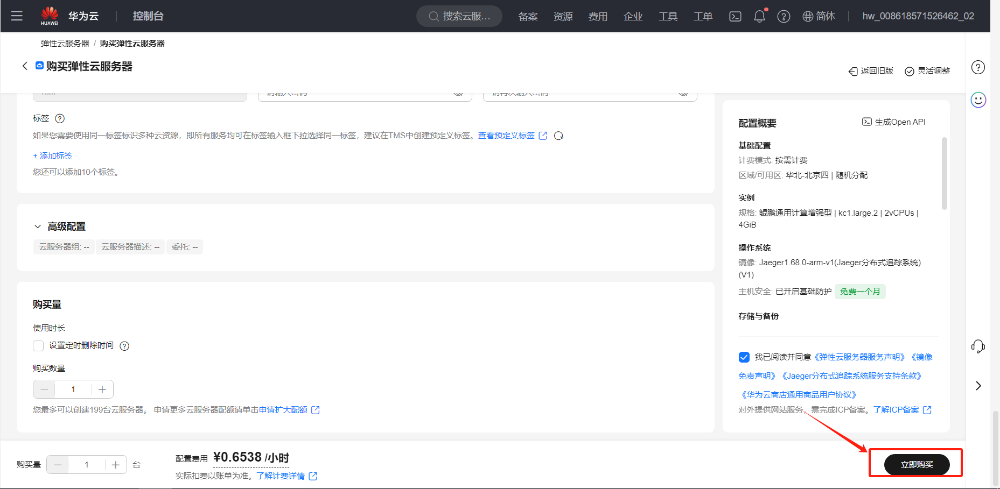
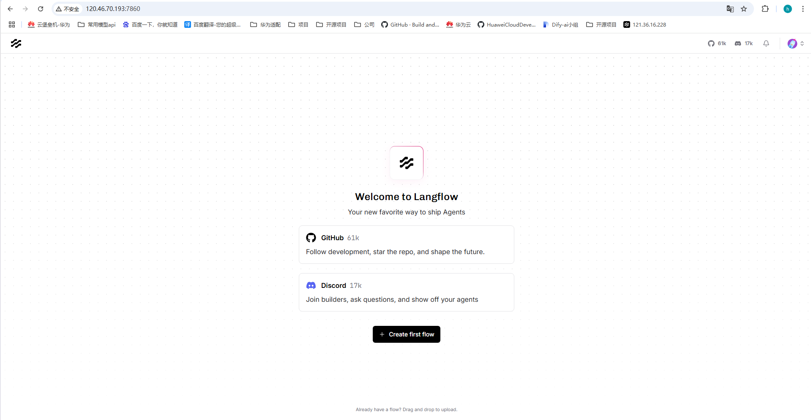
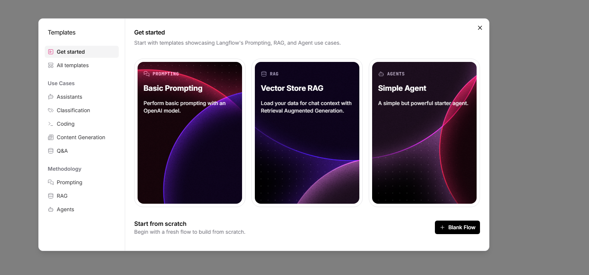
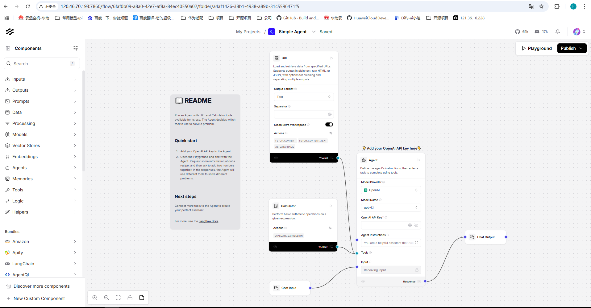
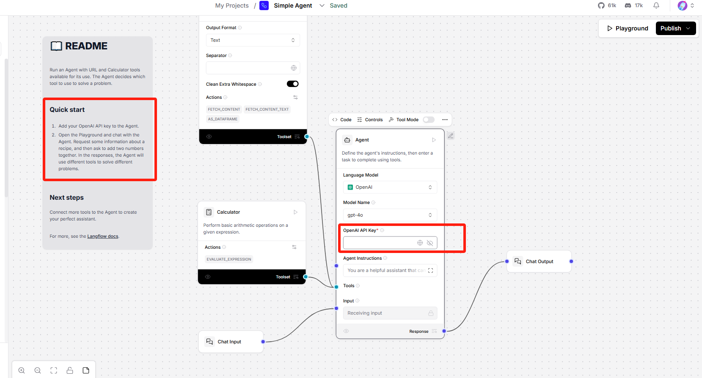

# vLLM Large Model Service
## Product Link
[Langflow tool]()

## Product Description
[Langflow](https://github.com/langflow-ai/langflow) is a powerful tool for building and deploying AI-powered agents and workflows. It provides developers with both a visual authoring experience and built-in API and MCP servers that turn every workflow into a tool that can be integrated into applications built on any framework or stack. Langflow comes with batteries included and supports all major LLMs, vector databases and a growing library of AI tools.

This product is provided as a pre-installed image on Kunpeng Cloud with Ubuntu 24.04 and HCE 2.0 systems for user convenience.

## Purchasing the Product
You can search for "Langflow tool" in the Cloud Marketplace. 
For configuration:

- Select recommended region and specifications
- Choose billing method (Pay-as-you-go/Monthly/Yearly) based on your needs:
  - Short-term use: Recommended Pay-as-you-go
  - Long-term use: Recommended Monthly/Yearly
- Click "Buy Now" after confirming configuration

### Deploy Using RFS Template

Fill in required fields and click Next

After creating the plan, click Confirm

Click Deploy to execute the plan

"Apply required resource success" indicates successful resource creation

### ECS Console Configuration
#### Prerequisites

Before ECS console configuration, you need to set up **Security Group Rules**:

> **Security Group Rules Configuration:**
> - Allow inbound port 8000, with source IP including your client IP (otherwise access will be denied)
> - Allow inbound port `22` for CloudShell connection (for console debugging)
> - Enable all outbound traffic

#### Creating ECS

After preparation, navigate to [ECS Purchase](https://support.huaweicloud.com/qs-ecs/ecs_01_0103.html) page with the following configuration:

Select CPU Architecture

Select Server Specifications

Select Image

Complete other parameters as needed, then click "Buy Now"

> **Important Notes:**
- You may create your own VPC
- Select the security group configured in [**Prerequisites**](#prerequisites)
- For Elastic IP, select "Buy Now" and choose "Pay-by-traffic" (recommended 5Mbit/s bandwidth)
- Advanced configuration requires custom data injection, so select "Set Later" for login credentials
- Other options can remain default or be configured as needed

## Product Usage
### Using Langflow tool
**IP+7860访问UI**

## 点击  Create first flow，选择一个模板快速开始

## 配置模型参数

### 参考文档

### Reference Documentation
[Langflow  Documentation](l https://docs.langflow.org/)